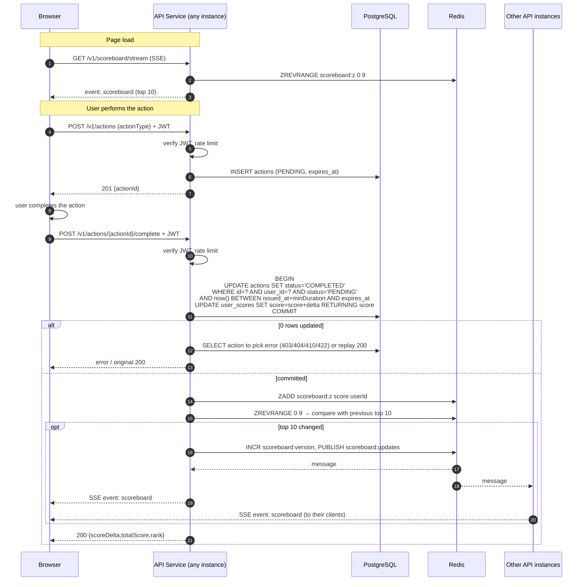
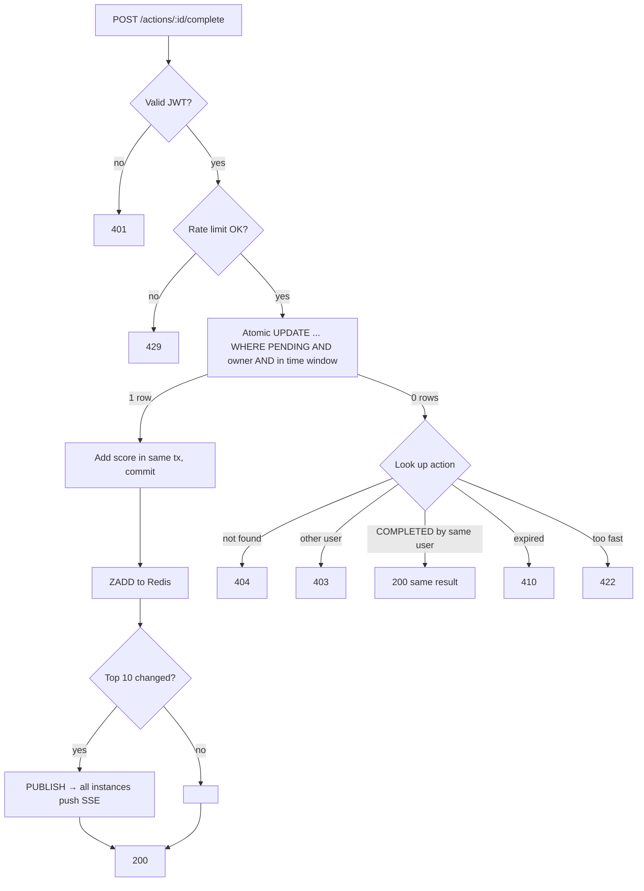

# Scoreboard Module: API Service Specification

Backend module that records user score increases and pushes a live **Top 10** scoreboard to every connected website client.

Audience: the backend team implementing it. Target stack follows the rest of this repo (Node.js + TypeScript + Express), but nothing here depends on it.

---

## 1. Responsibilities

| # | Requirement | How this module meets it |
|---|-------------|--------------------------|
| 1 | Scoreboard shows top 10 scores | `GET /v1/scoreboard` reads a ranked set (Redis sorted set) |
| 2 | Live updates | `GET /v1/scoreboard/stream` (Server-Sent Events) pushes the new top 10 whenever it changes |
| 3-4 | Completing an action increases the score via an API call | `POST /v1/actions` → `POST /v1/actions/:actionId/complete` |
| 5 | Stop unauthorised score increases | Authenticated user + server-issued single-use action ticket + server-decided score delta + rate limits |

**Out of scope:** what the action is, user registration/login (we consume an existing auth token), the frontend.

---

## 2. Core security rule

> **The client never tells the server how many points to add, and cannot complete an action the server did not start for that user.**

A bare `POST /score { userId, points }` is trivially abusable (replay it, change `userId`, change `points`). Instead:

1. **Identity comes from the token, never the body.** `userId` = `sub` claim of the verified JWT.
2. **Server-issued action ticket.** Before the user performs the action, the client asks the server to start one. The server stores `{actionId, userId, status: PENDING, issuedAt, expiresAt}` and returns `actionId`.
3. **Single use.** Completing the action atomically flips `PENDING → COMPLETED`. A second call with the same `actionId` changes nothing (idempotent, returns the original result).
4. **Bound to the user.** An `actionId` started by user A cannot be completed by user B.
5. **Time window.** Tickets expire (default 10 min). Completing earlier than the action's minimum plausible duration (`minDurationMs`, configurable per action type) is rejected. This stops scripts that call start+complete back to back.
6. **Points are server-side config.** `scoreDelta` is looked up from the action type on the server.
7. **Rate limits** per user and per IP on both endpoints.

---

## 3. API

All endpoints are under `/v1`. All write endpoints require `Authorization: Bearer <JWT>`. Errors use `{ "error": { "code": string, "message": string } }`.

### 3.1 `POST /v1/actions`: start an action

Auth: required.

Request
```json
{ "actionType": "default" }
```

Response `201`
```json
{ "actionId": "01J9Z6Q4N7...", "expiresAt": "2026-10-09T10:10:00Z" }
```

Errors: `401` bad/missing token · `400` unknown `actionType` · `429` rate limited.

### 3.2 `POST /v1/actions/:actionId/complete`: complete the action, add score

Auth: required. No body.

Response `200`
```json
{ "userId": "u_123", "scoreDelta": 10, "totalScore": 1240, "rank": 7 }
```
`rank` is `null` when outside the top 10.

Errors:

| Status | Code | When |
|--------|------|------|
| 401 | `UNAUTHENTICATED` | missing / invalid / expired JWT |
| 403 | `ACTION_NOT_OWNED` | ticket belongs to another user |
| 404 | `ACTION_NOT_FOUND` | unknown `actionId` |
| 410 | `ACTION_EXPIRED` | past `expiresAt` |
| 422 | `ACTION_TOO_FAST` | completed before `minDurationMs` |
| 429 | `RATE_LIMITED` | over limit |

Repeating a successful call returns `200` with the same body (idempotent).

### 3.3 `GET /v1/scoreboard`: current top 10

Auth: none (public). Used for first paint and as fallback.

Response `200`
```json
{
  "version": 4182,
  "updatedAt": "2026-10-09T10:01:02Z",
  "entries": [
    { "rank": 1, "userId": "u_9", "displayName": "alice", "score": 5120 }
  ]
}
```

### 3.4 `GET /v1/scoreboard/stream`: live updates (SSE)

Auth: none. `Content-Type: text/event-stream`.

- On connect: immediately sends one `scoreboard` event with the current top 10.
- After that: sends a `scoreboard` event **only when the top 10 actually changes** (membership, order or score).
- Heartbeat comment line (`: ping`) every 25 s to keep proxies from closing the connection.

```
event: scoreboard
id: 4183
data: {"version":4183,"updatedAt":"...","entries":[...]}
```

Clients send the full list, not diffs; 10 rows is tiny and removes any client-side merge bugs. On reconnect the browser's `EventSource` reconnects automatically; the initial event resyncs it.

Why SSE, not WebSocket: traffic is server → client only, SSE works over plain HTTP, auto-reconnects, and needs no extra library.

---

## 4. Data model

**PostgreSQL (source of truth)**

```sql
CREATE TABLE user_scores (
  user_id    TEXT PRIMARY KEY,
  score      BIGINT NOT NULL DEFAULT 0,
  updated_at TIMESTAMPTZ NOT NULL DEFAULT now()
);

CREATE TABLE actions (
  action_id    TEXT PRIMARY KEY,              -- ULID, unguessable
  user_id      TEXT NOT NULL,
  action_type  TEXT NOT NULL,
  status       TEXT NOT NULL CHECK (status IN ('PENDING','COMPLETED')),
  score_delta  INT,                           -- set on completion
  issued_at    TIMESTAMPTZ NOT NULL,
  expires_at   TIMESTAMPTZ NOT NULL,
  completed_at TIMESTAMPTZ
);
CREATE INDEX ON actions (user_id, issued_at);
```

`actions` doubles as an audit log of every score change.

**Redis**

| Key | Type | Purpose |
|-----|------|---------|
| `scoreboard:z` | sorted set (member `userId`, score) | ranking; `ZREVRANGE 0 9 WITHSCORES` |
| `scoreboard:version` | integer | incremented on each top-10 change |
| `scoreboard:updates` | pub/sub channel | fan-out to all API instances |
| `rl:{userId}` / `rl:ip:{ip}` | counter with TTL | rate limiting |

Redis can be rebuilt from `user_scores` at any time (see §7).

---

## 5. Flow of execution

### 5.1 Sequence



### 5.2 Complete-action decision flow



---

## 6. Implementation notes

- **Atomicity.** The ticket state change and score increment must be in **one DB transaction** using a conditional `UPDATE ... WHERE status='PENDING'`. This is what makes double-submits and races safe without locks.
- **Redis after commit.** Write to Redis only after the DB commit. If the Redis write fails, log it and let the reconciler (§7) fix it; do not fail the request, since the score is already saved.
- **Change detection.** Each instance keeps the last published top 10 in memory, but the decision to publish is made by the instance that handled the write (compare `ZREVRANGE 0 9` before/after, or simply compare the new score against the 10th score). Publishing a few redundant events is harmless; clients replace the whole list.
- **Fan-out.** Every API instance subscribes to `scoreboard:updates` on startup and writes the payload to all its open SSE responses. No sticky sessions needed.
- **Throttle broadcasts.** Coalesce updates to at most one push per 250 ms per instance so a burst of scores doesn't flood clients.
- **Display names.** Join from the users service/table when building the payload; cache them in Redis (`user:{id}:name`) to avoid a DB hit per broadcast.
- **Config.** Per action type: `scoreDelta`, `minDurationMs`, `ttlMs`. Kept in server config, never sent by the client.
- **Rate limits (defaults).** `POST /actions`: 30/min per user, 120/min per IP. `complete`: same. Tune from real traffic.
- **Observability.** Metrics: completes/sec, rejections by code, SSE connections, broadcast latency. Alert on spikes in `ACTION_TOO_FAST` / `ACTION_NOT_OWNED` (cheating attempts).

### Tests the team should write

1. Complete with valid ticket → score +delta, 200.
2. Complete same ticket twice (also concurrently) → score added once.
3. User B completes user A's ticket → 403, no score change.
4. Expired ticket → 410; too fast → 422.
5. Request body containing `points` / `userId` is ignored.
6. Score change that enters top 10 → SSE clients on **another instance** receive the event.
7. Score change outside top 10 → no SSE event.
8. Redis flushed → reconciler rebuilds identical top 10.

---

## 7. Reliability

- **Reconciler job** (every few minutes and on boot): rebuild `scoreboard:z` from `user_scores` (`ZADD` in batches). Keeps Redis correct after failed writes or a Redis restart.
- **Ticket cleanup:** delete or archive `PENDING` actions past `expires_at` daily.
- **Scaling:** API instances are stateless apart from open SSE connections; scale horizontally. SSE connections are long-lived, so set load-balancer idle timeout above the 25 s heartbeat.

---

## 8. Suggested improvements / open questions

1. **Best option if possible: don't let the browser report completion at all.** If the action happens on a server we control (game server, payment, quiz grading), that service should call the score module directly (internal, service-to-service auth) or emit an event to a queue. The ticket scheme above only proves the user *started and claimed* an action within plausible time; it cannot prove the action really happened on the client. Product should confirm which case applies.
2. **Action proof.** If the action must stay client-side, attach evidence the server can check (e.g. answer hashes, signed result from a trusted component, CAPTCHA / Turnstile token for high-value actions).
3. **Anomaly detection.** Flag users whose score rate is far above normal; hold their scoreboard entry for review instead of showing it live.
4. **Daily / per-user caps** on score gain as a simple ceiling on damage.
5. **Queue for writes** (e.g. Redis Streams / SQS) if write volume grows beyond what one DB transaction per action can handle.
6. **Leaderboard periods** (daily/weekly/all-time): only one extra sorted set per period if wanted later.
7. **Ties:** define ordering rule (suggest: earlier `updated_at` wins). Encode by storing `score * 1e10 + (MAX_TS - updated_at_seconds)` in the sorted set, or sort ties in app code.
8. **Privacy:** expose `displayName` only, never emails or internal IDs if they are sensitive.
9. **Fallback:** clients that can't hold SSE (some corporate proxies) poll `GET /v1/scoreboard` every 5-10 s; `version` lets them skip re-rendering when nothing changed.
